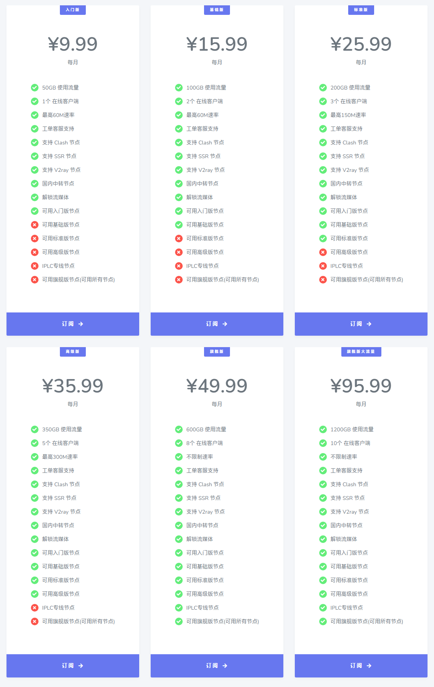

# 疾风云机场官网地址

最新地址1：[https://jifeng77.xyz](https://jifeng77.xyz/auth/register?code=PLZY)

最新地址2：[https://jifeng99.xyz](https://jifeng99.xyz/auth/register?code=Y13g)

或者

[疾风云机场官网备用地址](https://xuv.cc/out/jifeng)

## 疾风云介绍

疾风云机场，支持 Clash 节点，支持 SSR 节点，支持 V2ray 节点，国内中转节点。

解锁流媒体，IPLC专线节点。最高不限制速率，最多10个在线客户端。

节点数量160+，国家或地区包括：香港, 台湾, 日本, 法国, 美国, 韩国, 马来西亚, 新加坡等。

## 疾风云怎么样？

JFCloud疾风云机场，是实力老牌机场旗下的新开分站，高性价比机场。使用隧道中转优化线路与IPLC国际专线，采用SSR协议和V2Ray协议及Trojan协议，抗封锁能力强，多条的优质线路节点主要集中在美国、日本、香港、台湾、新加坡、马来西亚、韩国、法国等中国用户常用国家与地区。

## 疾风云优惠码

【优惠活动】

包年9折优惠代码：[Jifeng](https://xuv.cc/out/jifeng)

## 疾风云机场套餐价格

月付低至 ￥9.99/月

|套餐|入门版|基础版|标准版|高级版|旗舰版|旗舰版大流量|
|----|----|----|----|----|----|----|
|月付|¥9.9|¥15.99|¥25.99|¥35.99|¥49.99|¥95.99|
|季付|¥29.97|¥49.97|¥77.97|¥107.97|¥149.97|¥287.97|
|半年付|¥59.94|¥95.94|¥155.94|¥215.94|¥299.94|¥575.94|
|年付|¥119.88|¥191.88|¥311.88|¥431.88|¥599.88|¥1151.88|
|两年付|¥239.76|¥383.76|¥623.76|¥863.76|¥1199.76|¥2303.76|

